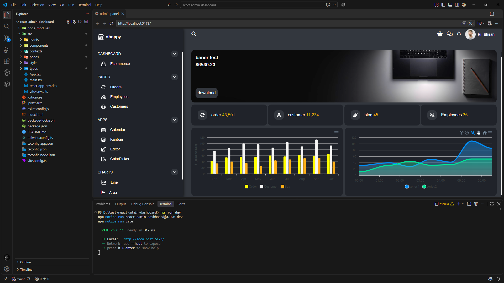

# Modern Admin Dashboard

A modern, responsive, and interactive admin dashboard built with **React, TypeScript, Vite, and Tailwind CSS**. Designed with a clean and elegant user interface, featuring data visualization, a responsive sidebar, and customizable dashboard layouts with drag-and-drop functionality.

<p align="center">
  
</p>

## ✨ Features

* **Modern UI:** Clean, elegant, and user-friendly dashboard interface.
* **Responsive Design:** Fully responsive layout optimized for desktop, tablet, and mobile devices.
* **Interactive Charts:** Data visualization and analytics using interactive charts.
* **Responsive Sidebar:** Collapsible navigation sidebar that adapts to different screen sizes.
* **Drag & Drop:** Reorganize dashboard components by dragging and dropping them with your mouse.
* **Customizable Layout:** Easily rearrange dashboard sections to personalize your workspace.
* **TypeScript:** Type-safe development for better maintainability and code quality.
* **Fast Development:** Powered by Vite for a fast development experience.

## 🛠️ Tech Stack

| Technology          | Purpose                           |
| ------------------- | --------------------------------- |
| React               | UI development                    |
| TypeScript          | Type safety                       |
| Vite                | Development server and build tool |
| Tailwind CSS        | Styling and responsive design     |
| Chart Library       | Data visualization                |
| Drag & Drop Library | Interactive dashboard layout      |

## 🚀 Getting Started

### Prerequisites

Make sure you have the following installed:

* Node.js (v18 or later recommended)
* npm, yarn, or pnpm

### Installation

1. Clone the repository:

```bash
git clone https://github.com/your-username/your-repository.git
```

2. Navigate to the project directory:

```bash
cd your-repository
```

3. Install dependencies:

```bash
npm install
```

4. Start the development server:

```bash
npm run dev
```

5. Open the local URL provided by Vite in your browser.

### Build for Production

```bash
npm run build
```

### Preview Production Build

```bash
npm run preview
```

## 📸 Screenshots

Add your project screenshots to the `screenshots` directory and reference them here.

## 📁 Project Structure

```text
├── public/
├── src/
│   ├── components/
│   ├── pages/
│   ├── assets/
│   ├── App.tsx
│   └── main.tsx
├── screenshots/
│   └── dashboard-preview.png
├── index.html
├── package.json
├── tsconfig.json
└── vite.config.ts
```

*Note: The project structure may vary depending on the implementation.*